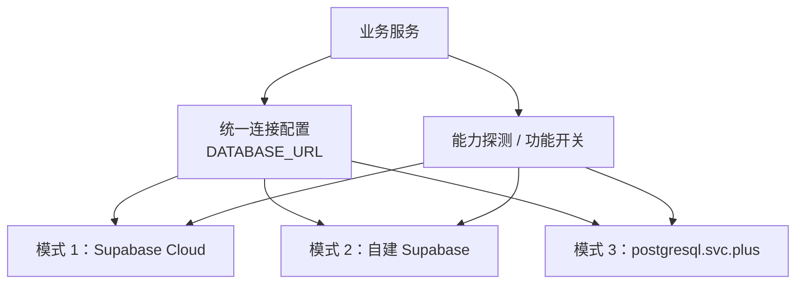

# PostgreSQL 多环境兼容与 Supabase 迁移交接方案

> **范围**：`ai-workspace-service` 与 `postgresql.svc.plus` 的数据库连接、迁移和可选扩展。
>
> **目标**：以同一套应用数据访问代码和迁移基线，运行于 Supabase Cloud、自建 Supabase 或原生 `postgresql.svc.plus`。环境切换的常规操作应只变更 `DATABASE_URL`；使用非通用扩展的功能必须有明确的能力保护与降级路径。

## 1. 架构原则：三轨多模式驱动



“仅切换 `DATABASE_URL`”适用于连接层和使用 PostgreSQL 通用能力的业务代码。以下情形不应假定只改连接串即可完成切换：

- 迁移直接创建目标环境未提供的扩展、函数或 schema；
- 业务 SQL 直接调用 `pgmq` 或 `pg_jieba`；
- 使用 Supabase Auth、Storage、Realtime 等平台 API（这些不是 PostgreSQL 连接能力）。

因此，所有必须跨模式运行的迁移均应幂等、可重复执行，并将可选能力隔离为可跳过的迁移；业务代码在调用可选能力前必须检查能力开关或扩展存在性。

## 2. 三种运行模式

| 部署模式 | 扩展支持 | 网络与连接入口 | 运维成本 | 适用场景与优势 |
| --- | --- | --- | --- | --- |
| **1. Supabase Cloud** | `pgvector` 与平台允许启用的标准 PostgreSQL 扩展；`pg_jieba`、`pgmq` 必须以实例扩展目录实测为准 | PostgreSQL direct connection **5432**；Supavisor pooler 常用 **6543**；原生 TLS | 零运维 | 快速上线、托管备份与控制台能力、无需维护数据库服务器 |
| **2. 自建 Supabase** | `pgvector`；可按自建镜像加入 `pg_jieba` / `pgmq` | PostgreSQL 或 Supavisor 的数据库端口按部署配置；Gateway / Studio **8000** 是 HTTP API 与管理入口，**不是**数据库连接入口 | 低（Docker Stack） | 需要 Auth / Studio / API，同时数据须留在私有云或本地 |
| **3. `postgresql.svc.plus`（原方案）** | `pgvector` + `pg_jieba` + `pgmq` | PostgreSQL **5432**；Stunnel TLS **5443**（默认） | 自行维护 | 轻量单机或 K8s 部署；可使用数据库内中文分词和队列 |

端口应由实际项目配置与 Supabase 控制台的连接信息为准；不要把固定端口硬编码到代码或迁移中。

## 3. 兼容性契约

### 3.1 必选与可选能力

| 类别 | 能力 | 跨三轨要求 |
| --- | --- | --- |
| 必选 | PostgreSQL、`vector`、`pg_trgm`、`hstore`、`uuid-ossp`、JSONB、GIN | 迁移失败即停止；上线前逐环境验证 |
| 可选 | `pg_jieba` 中文分词 | 不可用时使用 PostgreSQL 原生全文检索配置或在应用侧分词；不得创建依赖 `jiebacfg` 的必选索引 |
| 可选 | `pgmq` | 不可用时改用应用队列/外部队列；队列创建与调用不能出现在核心 schema 迁移中 |
| 平台能力 | Auth、Storage、Realtime、Edge Functions | 经 REST/SDK 集成；不属于 `DATABASE_URL` 的迁移范围 |

当前初始化脚本中已经包含 `pg_jieba`、`pgmq`、`jiebacfg` 索引和 `pgmq.create(...)` 示例。它们须从所有环境必跑的核心迁移中拆分，或改为安全跳过的演示初始化内容，否则 Supabase Cloud 可能在初始化阶段失败。

### 3.2 统一连接约定

应用只读取一个标准变量：

```dotenv
# 不提交真实用户名、密码、主机名或项目引用。
DATABASE_URL=postgresql://<user>:<password>@<host>:<port>/<database>?sslmode=<require-or-verify-full>
```

- Supabase Cloud：使用控制台提供的 direct 或 pooler URL，并保留其 TLS 参数。
- 自建 Supabase：使用 PostgreSQL/Supavisor URL；不要将 Studio/Gateway 的 `:8000` 填入 `DATABASE_URL`。
- 原生模式：直连时按部署 TLS 策略设置参数；经 Stunnel 时连接本地监听地址和端口，由隧道负责 TLS。
- 密码应仅通过部署平台的 Secret 注入；日志、文档示例和异常信息不得输出完整 URL。

连接池模式应避免依赖 session state：在事务外不使用临时表、`SET` 会话变量、预处理语句或依赖固定连接的 advisory lock。确有需求时，选择 direct/session pool 并在部署说明中标注。

## 4. 落地步骤

### 步骤 1：拆分迁移并安全加载扩展

将迁移分为 `core` 与 `optional` 两类：

1. `core` 只包含三轨均已验证的扩展和业务 schema；使用 `CREATE EXTENSION IF NOT EXISTS`，并以 `psql -v ON_ERROR_STOP=1` 执行。
2. `optional/pg_jieba` 与 `optional/pgmq` 独立编号、可单独执行；失败时记录“不可用”并跳过，不影响核心 schema。
3. 可选扩展安装必须用受控异常块，且后续依赖对象也要在同一能力分支内创建；仅捕获扩展安装错误但继续创建 `jiebacfg` 索引或调用 `pgmq.create` 仍会失败。

示例（适用于可选迁移，不替代核心迁移的失败处理）：

```sql
DO $$
BEGIN
  CREATE EXTENSION IF NOT EXISTS pg_jieba;
  RAISE NOTICE 'pg_jieba available';
EXCEPTION WHEN OTHERS THEN
  RAISE NOTICE 'pg_jieba unavailable; skip optional Chinese tokenizer objects';
END $$;
```

对 `pgmq` 使用同样模式，并只在确认扩展已安装后创建队列。应在目标 Supabase 项目中先查询可用扩展目录；不要把“平台可能支持”当作发布前提。

### 步骤 2：引入能力探测与功能开关

部署后执行只读检查，并把结果写入应用启动日志（不含连接串）：

```sql
SELECT extname, extversion
FROM pg_extension
WHERE extname IN ('vector', 'pg_trgm', 'hstore', 'uuid-ossp', 'pg_jieba', 'pgmq')
ORDER BY extname;
```

- 缺少必选扩展：阻止部署或使健康检查失败。
- 缺少可选扩展：设置 `DB_CAP_PG_JIEBA=false` / `DB_CAP_PGMQ=false`（或等价配置），走已验证的降级实现。
- 迁移工具与应用使用同一份能力矩阵；不得依赖“某环境默认已有扩展”的隐式假设。

### 步骤 3：导出、导入与清理

现有 `scripts/export_schema_clean.sh` 只过滤 `pglogical`，且未接收命令行传入的 `DATABASE_URL`。在实现 Supabase 导出前，应将其改为：

1. 接收来源 URL 和输出文件路径，且不打印完整 URL；
2. 使用 `pg_dump --schema-only --no-owner --no-privileges`；
3. 基于明确的扩展与 schema 白/黑名单处理对象，而不是仅用 `grep` 删除 `CREATE EXTENSION` 行；
4. 对输出执行静态检查，确保不存在 `pg_jieba`、`pgmq`、`pglogical` 的对象引用，再在空目标库以 `ON_ERROR_STOP=1` 演练导入；
5. 数据迁移单独执行，并在切换窗口内完成一致性校验、备份与回滚点记录。

### 步骤 4：连接串切换与回滚

1. 在目标环境创建空数据库/项目并启用必选扩展。
2. 执行 core migration，执行可选 migration 并保存能力报告。
3. 导入数据或使用业务迁移工具完成同步；核对表数、行数、关键索引、向量查询和应用健康检查。
4. 仅更新 Secret 中的 `DATABASE_URL`，滚动发布应用；观察错误率、连接数、慢查询和队列降级指标。
5. 保留旧库只读且不写入，直至验收窗口结束；回滚时恢复旧 `DATABASE_URL`，不要双向写入两个数据库。

## 5. 验收清单

- [ ] 三种环境各有一份不含凭据的 `DATABASE_URL` 配置样例与 TLS 验证记录。
- [ ] core migration 在三轨均以 `ON_ERROR_STOP=1` 成功执行。
- [ ] `pg_jieba`、`pgmq` 缺失时，迁移和应用均能明确降级且无运行时 SQL 错误。
- [ ] Supabase Cloud 使用平台控制台给出的数据库连接 URL；未将 `:8000` 作为 PostgreSQL URL。
- [ ] 导出文件不包含不支持扩展及其依赖对象，并已在空目标环境演练导入。
- [ ] 通过向量查询、全文检索降级路径、核心读写、连接池并发和回滚 URL 切换测试。
- [ ] 切换前完成可恢复备份，切换期间确认无双写。

## 6. 选择建议

- 优先 **Supabase Cloud**：希望快速上线且接受托管数据库边界。
- 选择 **自建 Supabase**：需要 Supabase 平台能力，同时数据驻留或网络隔离有要求。
- 保持 **`postgresql.svc.plus`**：资源有限、只需 PostgreSQL，或强依赖 `pg_jieba` / `pgmq`。

成本、配额、可用扩展和 pooler 端口均会随 Supabase 项目区域、套餐及平台版本变化；上线前应以目标项目控制台和扩展目录的实时信息复核。
